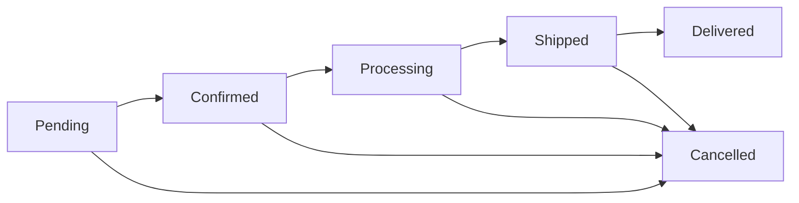
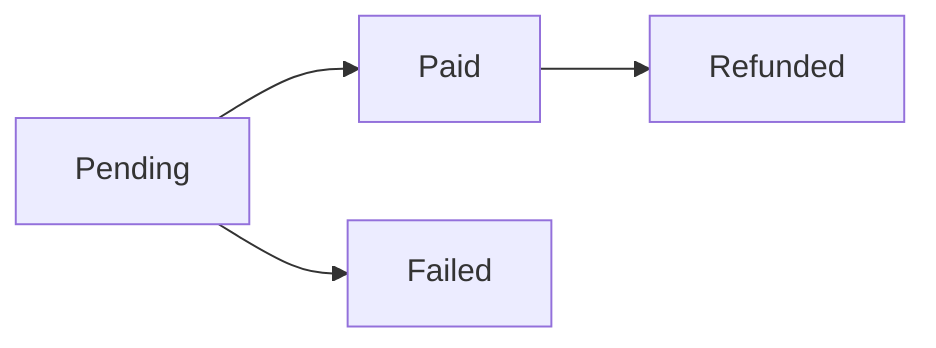

# 🛒 Order Management System

A comprehensive order management system for admin users to track, manage, and update customer orders with real-time status tracking and analytics.

## ✨ Features

### 📊 **Order Dashboard & Analytics**
- **Real-time Statistics**: Total orders, revenue, pending orders, and delivery counts
- **Status Breakdown**: Visual representation of orders by status (pending, confirmed, processing, shipped, delivered, cancelled)
- **Payment Summary**: Payment status tracking and revenue analytics
- **Period-based Reporting**: Configurable date ranges for statistics (default: last 30 days)

### 🔍 **Advanced Filtering & Search**
- **Search Orders**: By order number, customer name, or email
- **Status Filtering**: Filter by order status and payment status
- **Date Range Filtering**: Filter orders by order date range
- **Amount Filtering**: Filter by minimum and maximum order amounts
- **Collapsible Filters**: Clean, organized filter interface

### 📋 **Order Management Table**
- **Comprehensive Order View**: Order details, customer info, amounts, and statuses
- **Inline Status Updates**: Direct dropdown updates for order and payment statuses
- **Expandable Details**: Click to view full order information including:
  - Order items with quantities and prices
  - Shipping address details
  - Payment method and customer contact info
  - Admin notes and tracking information
- **Responsive Design**: Works on all device sizes

### 🔄 **Status Management**
- **Order Statuses**: 
  - `pending` → `confirmed` → `processing` → `shipped` → `delivered`
  - `cancelled` (can be set at any stage)
- **Payment Statuses**:
  - `pending` → `paid`
  - `failed` → `refunded`
- **Real-time Updates**: Status changes reflect immediately in the UI
- **Audit Trail**: Timestamps for all status changes

### 📱 **User Experience**
- **Dark/Light Mode**: Consistent with the application theme
- **Loading States**: Smooth loading animations and skeleton screens
- **Error Handling**: Graceful error handling with user-friendly messages
- **Responsive Layout**: Optimized for desktop, tablet, and mobile devices

## 🚀 Getting Started

### 1. **Access the System**
Navigate to: `/admin-management/orders`

### 2. **Seed Sample Data** (Optional)
```bash
npm run seed:orders
```
This will create 6 sample orders with various statuses for testing.

### 3. **View Orders**
- Orders are displayed in a table format
- Use filters to narrow down results
- Click "View Details" to expand order information

### 4. **Update Statuses**
- Use the dropdown menus in the "Order Status" and "Payment Status" columns
- Changes are saved automatically
- Statistics update in real-time

## 🏗️ Architecture

### **Frontend Components**
- `OrderManagementTable`: Main table component with inline editing
- `OrderStats`: Statistics dashboard with charts and metrics
- `OrderFilters`: Advanced filtering interface
- `OrdersPage`: Main page orchestrating all components

### **Backend API Endpoints**
- `GET /api/admin/orders`: Fetch orders with filtering and pagination
- `GET /api/admin/orders/stats`: Get order statistics and analytics
- `PUT /api/admin/orders/[id]/status`: Update order/payment status

### **Data Model**
```typescript
interface Order {
  _id: string;
  orderNumber: string;           // Auto-generated unique identifier
  customerName: string;          // Customer's full name
  customerEmail: string;         // Customer's email address
  customerPhone: string;         // Customer's phone number
  orderDate: Date;              // When the order was placed
  totalAmount: number;           // Total order value
  orderStatus: OrderStatus;      // Current order status
  paymentStatus: PaymentStatus;  // Current payment status
  paymentMethod: string;         // How customer paid
  shippingAddress: Address;      // Delivery address
  items: OrderItem[];           // Products ordered
  notes?: string;               // Customer notes
  trackingNumber?: string;      // Shipping tracking
  estimatedDelivery?: Date;     // Expected delivery date
  actualDelivery?: Date;        // Actual delivery date
  adminNotes?: string;          // Internal admin notes
  lastStatusUpdate: Date;       // Last status change timestamp
}
```

## 🔧 Configuration

### **Order Status Flow**


### **Payment Status Flow**


### **Filter Options**
- **Order Status**: All, Pending, Confirmed, Processing, Shipped, Delivered, Cancelled
- **Payment Status**: All, Pending, Paid, Failed, Refunded
- **Date Range**: Start and end dates for order filtering
- **Amount Range**: Minimum and maximum order amounts
- **Search**: Text search across order number, customer name, and email

## 📊 Statistics & Analytics

### **Key Metrics**
- **Total Orders**: Count of all orders in the selected period
- **Total Revenue**: Sum of all order amounts
- **Status Distribution**: Breakdown of orders by current status
- **Payment Summary**: Count of orders by payment status
- **Period Comparison**: Configurable time periods (7, 30, 90 days)

### **Real-time Updates**
- Statistics refresh automatically when orders are updated
- Live counters for each status category
- Revenue calculations update in real-time

## 🛡️ Security & Permissions

### **Access Control**
- Requires `admin:read` permission
- All API endpoints are protected
- Session-based authentication

### **Data Validation**
- Input sanitization for all user inputs
- Status validation against allowed values
- Order existence verification before updates

## 🔄 API Reference

### **Get Orders**
```http
GET /api/admin/orders?orderStatus=pending&paymentStatus=paid&search=john&minAmount=100&maxAmount=500&startDate=2024-12-01&endDate=2024-12-31&page=1&limit=50
```

**Query Parameters:**
- `orderStatus`: Filter by order status
- `paymentStatus`: Filter by payment status
- `search`: Search in order number, customer name, or email
- `minAmount`/`maxAmount`: Filter by order amount range
- `startDate`/`endDate`: Filter by order date range
- `page`: Page number for pagination
- `limit`: Number of orders per page

### **Get Order Statistics**
```http
GET /api/admin/orders/stats?days=30
```

**Query Parameters:**
- `days`: Number of days to include in statistics (default: 30)

### **Update Order Status**
```http
PUT /api/admin/orders/{orderId}/status
Content-Type: application/json

{
  "orderStatus": "shipped",
  "paymentStatus": "paid"
}
```

## 🎨 Customization

### **Adding New Statuses**
1. Update the `OrderStatus` enum in the model
2. Add new status to the UI dropdowns
3. Update status color schemes in `OrderManagementTable`
4. Add new status to statistics aggregation

### **Custom Fields**
- Add new fields to the Order model
- Update the frontend interfaces
- Modify the table display
- Update filtering options

### **Theme Integration**
- All components use Tailwind CSS classes
- Consistent with application design system
- Dark/light mode support
- Responsive breakpoints

## 🚨 Troubleshooting

### **Common Issues**

1. **Orders Not Loading**
   - Check database connection
   - Verify admin permissions
   - Check browser console for errors

2. **Status Updates Not Working**
   - Verify order ID exists
   - Check admin permissions
   - Ensure valid status values

3. **Statistics Not Updating**
   - Refresh the page
   - Check API endpoint responses
   - Verify database aggregation queries

### **Debug Mode**
Enable console logging for debugging:
```typescript
// In OrderManagementTable.tsx
console.log('Order update:', orderId, newStatus, statusType);
```

## 📈 Performance Considerations

### **Database Optimization**
- Indexed fields: `orderNumber`, `customerEmail`, `orderStatus`, `paymentStatus`, `orderDate`, `totalAmount`
- Aggregation pipelines for statistics
- Pagination for large order sets

### **Frontend Optimization**
- Lazy loading of order details
- Debounced search inputs
- Efficient state management
- Optimized re-renders

## 🔮 Future Enhancements

### **Planned Features**
- **Bulk Operations**: Update multiple orders at once
- **Export Functionality**: CSV/PDF export of orders
- **Advanced Analytics**: Charts and trend analysis
- **Email Notifications**: Status change notifications
- **Integration**: Connect with shipping carriers
- **Mobile App**: Native mobile order management

### **API Extensions**
- **Webhooks**: Real-time status updates
- **Bulk Status Updates**: Multiple order updates
- **Order History**: Complete audit trail
- **Customer Communication**: In-app messaging

## 📝 Contributing

When contributing to the Order Management system:

1. **Follow the existing code structure**
2. **Add proper TypeScript types**
3. **Include error handling**
4. **Update documentation**
5. **Test with sample data**
6. **Maintain responsive design**

## 📞 Support

For issues or questions about the Order Management system:

1. Check the troubleshooting section
2. Review API documentation
3. Check browser console for errors
4. Verify database connectivity
5. Contact the development team

---

**Last Updated**: December 2024  
**Version**: 1.0.0  
**Compatibility**: Next.js 15+, React 19+, MongoDB 8+
